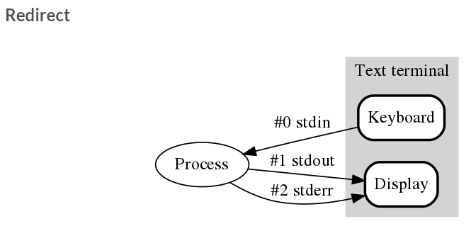
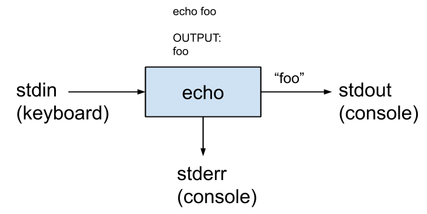

# 실전코딩 HW1
- redirection stderr, stdout, stdin

# rediretion
- 프로그램 결과 혹은 출력을 파일이나 다른 스트림으로 전달할때 사용
    - 사용법: ("출력") > ("전달 받을 파일")
- 
- 출처 <"https://shoark7.github.io/programming/knowledge/what-is-standard-stream">

# stdio.h
- Standard Stream
- 
- 출처 <"https://velog.io/@jakeseo_me/%EC%9C%A0%EB%8B%89%EC%8A%A4%EC%9D%98-stdin-stdout-stderr-%EA%B7%B8%EB%A6%AC%EA%B3%A0-pipes%EC%97%90-%EB%8C%80%ED%95%B4-%EC%95%8C%EC%95%84%EB%B3%B4%EC%9E%90">

## stdin
- 표준 입력은 프로그램에 입력되는 데이터의 표준적인 출력을 말한다.
- 쉘에서의 표준 입력은 키보드로 되어 있고, C에서 <stdio.h>에서는 File *stdin를 이용한다.
- 사용법: fscanf(stdin, (이하 scanf와 동일))

## stdout
- 표준 출력은 프로그램에서 출력되는 데이터의 표준적인 방향을 말한다
- 사용법: fprintf(stdout, (이하 printf와 동일))
## sdterr 
- 표준 출력을 보낼 때, 오류가 발생하면 오류 내용을 출력한다.
- 사용법: fprintf(stderr, (이하 printf와 동일))
