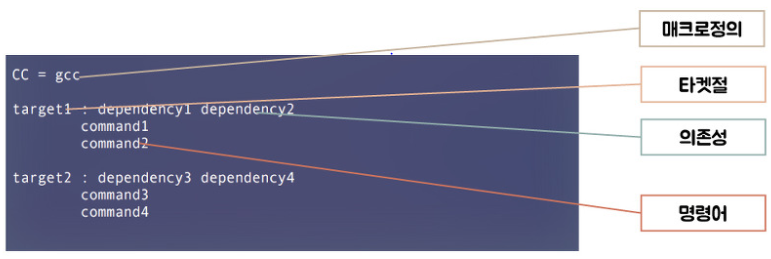

# 실전코딩2 HW2

# HW2_GCC

# CPP
- include file
    -- ex) #include <stdio.h> or "file.h"

- Conditional Complication
    - #if, #ifdef, #ifndef, #elif, #else, #endif

# GCC compile option
- -c: generate .o file
- -g: for debeg
- -O: optimization

# GCC compile - for multiple file
- ex) func.h, func.c, main.c
    - compile -gcc main.c func.c

# project HW2

## GCC compile -- by using preprocessor
- #ifdef, #else, #endif
    - func.c에서 int func_name_or_id() 구현 (no using #define PRINT_ID)
    - difference between gcc -DPRINT_ID main.c func.c and gcc main.c func.c
    - gcc -DPRINT_ID는 PRINT_ID가 정의된 상태로 컴파일 되므로 #ifdef 실행

# MakeFile 추가 HW4

## Make 이론
- maintain, update, and regenerate group of programs
- 많은 프로그램 모듈들로 구성된 대규모 프로그램을 효율적으로 유지하고, 일관성 있게 관리 하도록 도와주는 도구
- Target으로부터 dependency 판단하여 오브젝트파일 생성, 라이브러리 생성, 오브젝트 파일로부터 실행파일 생성

- 장점
    - 각 파일에 대한 반복적 명령의 자동화로 인한 시간 절약
    - 프로그램의 종속 구조를 빠르게 파악할 수 이쓰며 관리 용이
    - 단순 반복 작업 및 재작성을 최소화

## Make 구성
- 목적파일(Target): -c 명령어를 수행하여 결과로 출력된 파일
- 의존파일(Dependency): 목적파일을 만드는데 필요한 파일
- 명령어: 필요한 명령어들
- 매크로: 코드 단순화를 위한 작업
- 

## Make 매크로
- $@: 현재의 Target 파일명
- $?: 현재의 Target보다 더 최근에 갱신된 의존 파일 명단
- $*: 현재의 Target보다 더 최근에 갱신된 현재 의존 파일 명단
- $<: Dependency 파일 중 첫번째 파일명
- $^: 현재 모든 Dependency 파일들의 명단
- CC: Program for compiling C programs; default 'cc'
- CFLAGS: cc 명령어의 옵션설정

## test.c Makefile
- SRCS := test.c func.c
    - SRCS = test.c func.c
- OBJS := $(SRCS:.c=.o)
    - .c파일 -> .o파일
- CC := gcc
    - CC 매크로를 gcc로 설정
- CFLAGS := -c -Wall
    - 모든 c파일들을 warning 포함해서 컴파일
- main : $(OBJS)
    - main 이라는 이름으로 OBJS파일들 컴파일 하여 출력
- $(CC) -o $@ $^ -lm
    - test로 dependency파일들 모두 컴파일 하여 출력
- clean :
	- rm $(OBJS)
        - OBJS를 통해 만든 모든 .O 파일 삭제
	- rm main
        - main 파일 삭제
- dep :
	- gccmakedep $(SRCS)
        - SRCS 관련된 dependency 파일 모두 검색
