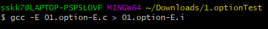
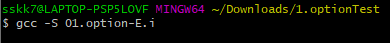
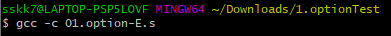
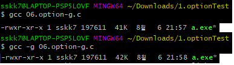
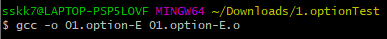
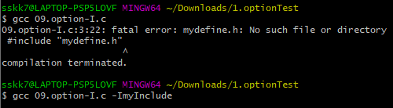
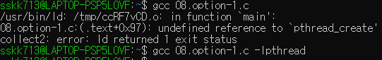
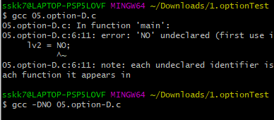
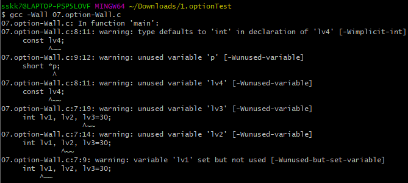
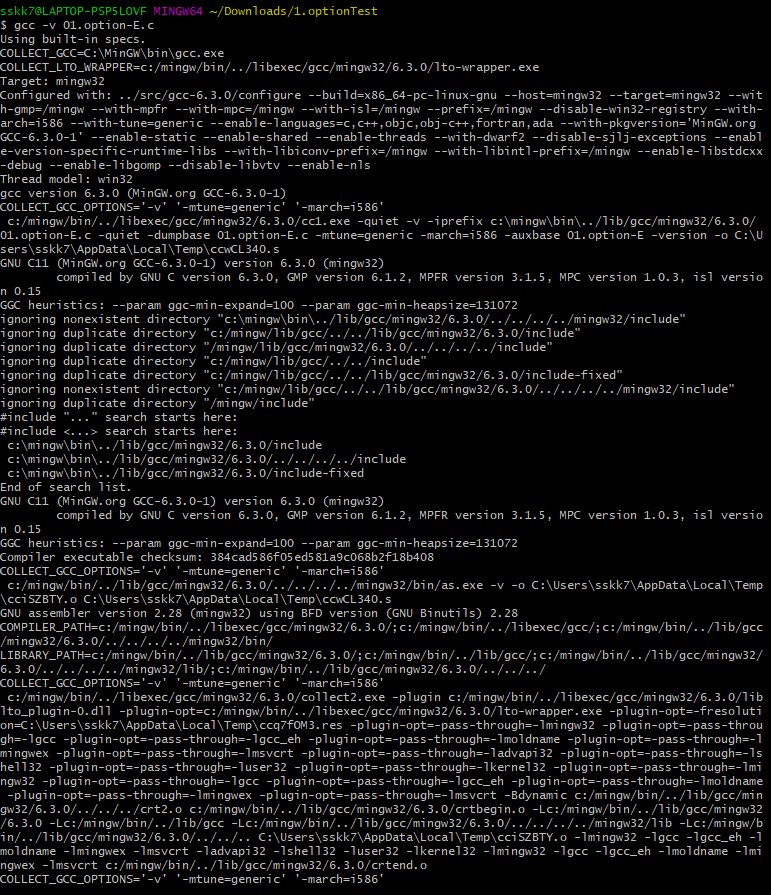

# 실전코딩2 HW3

## HW3_GCC

# Difference between Compiler and interpreter
- compiler
    1. 프로그래밍 언어를 Runtime 이전에 기계어로 해석
    2. 구동시에 코드와 함께 시스템으로부터 메모리를 할당받으며 할당받은 메모리 사용
    3. Runtime 이전에 해석을 마치고 바로 기계어로 전환되기 때문에 OS 및 빌드 환경에 종속적
    4. 종속적이므로 OS 환경에 맞게 호환되는 라이브러리와 빌드환경을 구분해서 구축

- interpreter
    1. Runtime 이후에 Row단위로 해석하며 프로그램 구동
    2. 프로그래밍 언어를 기계어로 바꾸지 않고 중간 단계를 거친 뒤, Runtime에 즉시 해석하기 때문에 compiler보다 낮은 퍼포먼스
    3. Runtime에 실시간 debugging 및 코드 수정 가능
    4. 메모리를 별도로 할당받아 수행되지 않고, 필요할 때 할당받아 사용

    - 출처: <https://jins-dev.tistory.com/entry/Compiler-%EC%99%80-Interpreter-%EC%9D%98-%EA%B0%9C%EB%85%90%EA%B3%BC-%EC%B0%A8%EC%9D%B4%EC%A0%90>

# GCC
1. 전처리
    - #include, #define과 같은 전처리기 부분을 처리함, 필요한 헤더 파일을 삽입하고 실행 문장의 매크로를 상수로 변환
2. 컴파일
    - 전처리된 파일로부터 어셈블리어루 된 파일 생성
3. 어셈블
    - 기계어로 된 오브젝트 파일로 변환
4. 링크
    - 라이브러리 함수와 오브젝트 파일을 연결하여 실행 파일을 생성

# GCC command
- -E option: 전처리까지만 실행항 .i file 생성
    - 사용법: gcc -E <""filename"">.c > <""filename"">.i
    - 

- -S option: 어셈블리까지 실행하여 .s file 생성
    - 사용법: gcc -S <"filename">.i
    - 

- -c option: 전처리, 컴파일, 어셈블 실행하지만 링크는 안함 -> .o file 생성
    - 사용법: gcc -c <"filename">.s
    - 

- -g option: 운영체제 고유의 형식으로 디버깅 정보를 만듦
    - 사용법: gcc- -g <"filename">.c
    - 
    - 디버깅 정보를 추가하여 컴파일 하였기 때문에 용량이 더 큼

- -o <"filename"> option: 출력파일의 이름을 지정할 수 있음
    - 사용법: gcc -o <"filename"> 01.option-E.c
    - 

- -I<""dir""> option: C source가 표준 디렉토리가 아닌 위치에 있는 헤더 파일을 가질 때, 해당 디렉토리 위치 지정해줌
    - 사용법: gcc <"filename">.c -l<"dir">
    - 

- -l<"libraryname">: 표준 라이브러리가 아닌 라이브러리를 사용하고 싶을 때, 해당 라이브러리 지정해줌
    - 사용법: gcc <"filename">.c -l<"libraryname">
    - 

- -L<"dir"> option: 사용자가 라이브러리를 직접 만들거나 새 라이브러리를 내려 받아 사용할 때, 해당 라이브러리 지정해줌
    - 사용법: gcc -L<"library directory">

- -D<"macro"> option: #define MACRO를 선언 해준다.
    - 사용법: gcc -D<정의할 MACRO 이름>
    - 
    - #define NO를 -DNO로 선언함으로써 오류없이 컴파일됨

- -O<"level"> option: -O1, O2, O3의 세가지의 옵션이 존재하고 최소한의 스레드 분기 동작 횟수를 줄인다. 컴파일 시간은 증가하지만, 실행은 빨라짐
    - 사용법: gcc -O2 <"filename">.c

- -wall: gcc가 제공하는 모든 경고 메시지 출력
    - 사용법: gcc -Wall <"filename">.c
    - 

- -v option: 컴파일 과정과 version 출력
    - 사용법: gcc -v <"filename">.c
    - 

