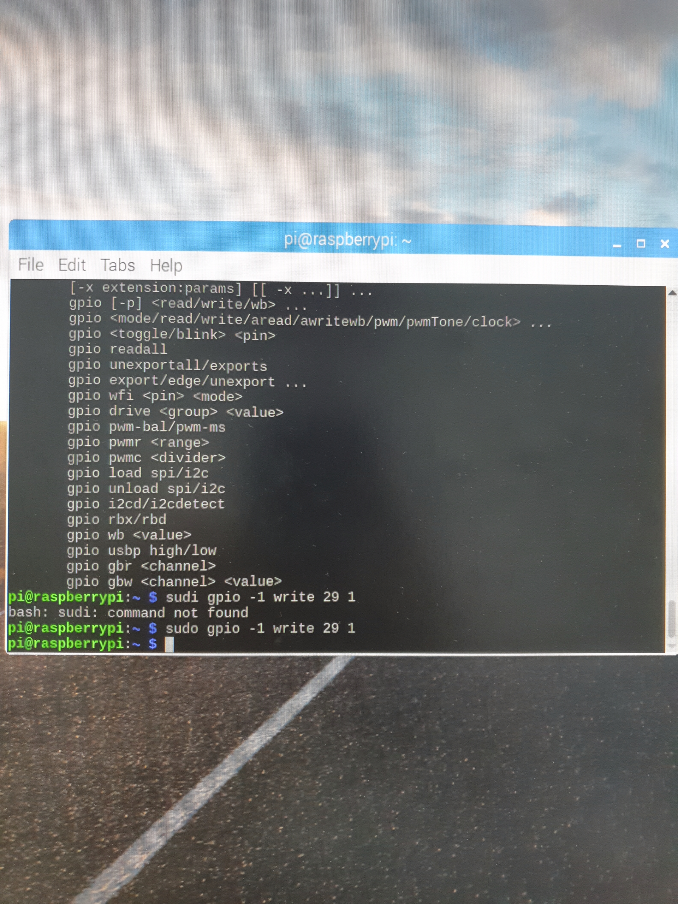

# 실전코딩 2

## HW4_GPIO 연결

## HW 사진1
- 

## HW 사진2
- 

## HW 사진3
- 

## HW GPIO 연결 코드

```C code
#include <stdio.h>
#include <wiringPi.h>

int main(){
    int i;
    if(wiringPiSetup()== -1) return -1;
    pinMode(29,OUTPUT);
    
    for(i=0 ; i<5; i++){
        digitalWrite(29,1);
        delay(500);
        digitalWrite(29,0);
        delay(500);
    }

    return 0;
}
```
