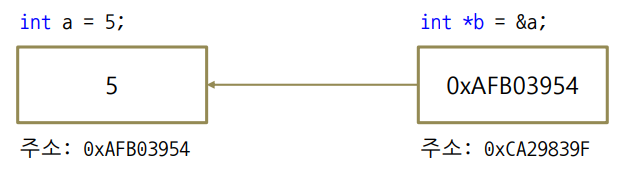
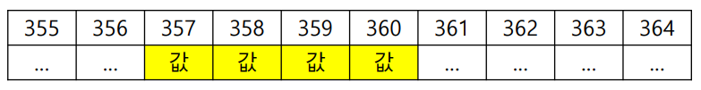
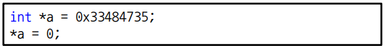

# 실전코딩 2

## HW5_Pointer

## 포인터 개념
- 포인터 변수는 메모리 주소를 저장한다.
- 포인터는 특정 변수 자체가 존재하는 메모리 주소의 값을 가진다.

<그림 1>
- 다음 사진처럼 a를 이용해서 5를 찾을 수 있고 포인터 변수 b를 이용해서 5를 찾을 수 있다.

<그림 2>
- int a = 5; 라고 변수를 할당하면 메모리 주소상에서 <그림 2>처럼 기록된다.
- int - 4byte
- long long - 8byte
- void - 1byte

## 포인터 주의사항
<그림 3>
- 위와 같은 코드는 부적절하다.
- 포인터는 컴퓨터 시스템의 특정 메모리에 바로 접근할 수 있기 때문에 기존에 존재하던 중요한 메모리 영역에 접근하지 않도록 한다.

## 포인터 관련 연산자
- 주소 연선자(&)
    - 변수 앞에 붙어서 변수의 메모리 시작 주소값을 구한다.

- 포인터(*)
    - 포인터 변수를 선언할 때 사용한다.

- 간접 참조 연산자(*)
    - 선언된 포인터 변수가 가리키는 변수를 구한다.

## 포인터 배열
- 예시코드 test4.c

``` C code
#include <stdio.h>

int main()
{
	int a[10], b[30], c[40]; 
	int * t[3]; 
	t[0] = a; 
	t[1] = b; 
	t[2] = c; 
	t[1][35] = 200; 
	printf("%d\n", b[35]); 
	for (int i = 0 ; i < 40 ; i++)	
		printf("%d ", c[i]); 
}
```
- 다음은 test4.c의 코드이고, 세개의 배열을 하나의 포인터 배열로 처리함
    - t[0] -> a[10]
    - t[1] -> b[30]
    - t[2] -> c[40]

## 함수 포인터
- 함수 포인터는 특정한 함수의 반환 자료형을 지정하는 방식으로 선언할 수 있다.
- 함수 포인터를 사용하면 형태가 같은 서로 다른 기능의 함수를 선택적으로 사용할 수 있다.

사용법: 반환 자료형(*이름)(매개변수) = 함수명;
- 예시코드 test5.c

```C code
#include <stdio.h>
int f10(int a)
{	return a+10; }
int f5(int a)
{	return a+5; }
int f1(int a)
{	return a+1; }
int f22(int a)
{	return a+22; }


int main()
{
	int a = 200; 
	int (*f[4])(int) = {f10, f5, f1, f22}; 
	printf("%d\n", f[2](10)); 
	
}
```
f[4]의 포인터 배열에 각각 f10, f5, f1, f22의 함수를 넣어 놓고 인덱스 2에 있는 f1함수에 10의 매개변수를 전달하여 리턴값 11을 받음

## 코드 분석
```C code
#include <stdio.h>

void func(int *p)
{
	int *q = p; 
	*q = 100; 
	q++;
	*q = 200; 
}

int main()
{
	int a = 1;
	int b = 2; 
	int *pa, *pb; 
	long long pp; 
	pa = &a; 
	pb = &b; 
	pp = (long long) pa; 
	printf("%d %d\n", a, b);
	func(&b); 
	printf("%d %d\n", *pa, *pb);
	printf("%d %d %d\n", pa, pb, *(int *) pp);
	printf("%d %d\n", a, b);
	printf("%d, %d, %d, %d\n", a, &a, *(&a), *(int *)(long long)(&a) );
}
```
- 다음 코드에서는 Memory주소를 받아서 새로운 포인터로 가리키게 만들면 쉽게 기존의 다른 포인터들의 값을 참조할 수 있다.
    - 해킹의 위험이 존재

```C code
#include <stdio.h>

int main()
{       
    int a[10] = { 0, 0, 0, 1, 4, 5, 6, 7, 8, 9}; 
    // void *b; 
    long long *c; 
    // b = &a[0]; 
    c = (long long *)a; 
    printf("%d, %d\n", a, *a); 
    printf("%x, %llx\n", c, *c); 
    printf("%x, %llx\n", c+1, *(c+1)); 
    float kk = 0.75f; 
    printf("%f : %d, %x \n", kk, *(int *)&kk, *(int *)&kk);
}
```
- 다음 코드에서는 int형 배열a를 long long형으로 캐스팅 하고 float형을 부동소수점으로 표현할 수 있다.