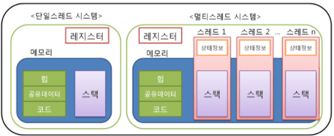

# 실전코딩2

## HW7_mutex

## MULTI THREAD
- 하나의 프로세스를 다수의 실행 단위로 구분하여 자원을 공유하고 자원의 생성과 관리의 중복성을 최소화하여 수행 능력을 향상시키는 것
- 하나의 프로그램에서 동시에 여러개의 일을 수행할 수 있도록 해준다.

- 출처: <https://goodgid.github.io/What-is-Multi-Thread/>

## MULTI THREAD 사용 이유
- 프로세스를 이용하여 동시에 처리하던 일을 쓰레드로 구현할 경우 메모리 공간과 시스템 자원 소모가 줄어듦
- 쓰레드 간의 통신이 필요한 경우에도 별도의 자원을 이용하지 않고 전역 변수의 공간 또는 동적으로 할당된 공간인 힙 영역을 이용하여 데이터를 주고 받음
- 쓰레드의 컨텍스트 교환은 캐시 메모리를 비울 필요가 없음
- 시스템의 처리량이 향상되고 자원 소모가 줄어 프로그램의 응답 시간이 단축됨

## MULTI PROCESS vs MULTI THREAD
- 멀티 프로세스는 데이터, 힙, 스택 영역 모두를 공유하지 않고 멀티 쓰레드는 스택 영역만 공유하지 않는다.

## MULTI THREAD의 문제점
- MULTI PROCESS는 공유하는 자원이 없기 떄문에 동일 자원에 대해서 접근이 전혀 없지만 MULTI THREAD는 이 접근에 대해 핸들링을 해야 한다.
- 서로 다른 쓰레드가 데이터와 힙 영역을 공유하기 때문에 하나의 쓰레드가 다른 쓰레드가 사용중인 변수나 쓰레기값을 읽어올 위험이 있기 때문에 동기화 작업이 필요함.
- 과도하게 동기화 작업을 할 시 병목 현상이 발생하여 성능이 저하될 수 있어서 과도한 락은 피해야 한다.

## MUTEX

- Critical Section을 가진 쓰레들들의 Running TIme이 서로 겹치지 않게 각각 단독으로 실행되게 하는 기술
- 접근을 핸들링 하기 위해 Locking과 Unlocking을 사용

## MUTEX 사용법
```
pthread_mutex_t a_mutex = PTHREAD_MUTEX_INITIALIZER;// 뮤텍스 생성 방법1
int pthread_mutex_init(pthread_mutex_t *mutex, const pthread_mutex_attr *attr) // 뮤텍스 생성 방법2
```
```
int pthread_mutex_lock(pthread_mutex_t *mutex);
// 뮤텍스 잠금을 위한 함수
// 성공하면 0을 리턴하고, 에러가 발생하면 에러번호(양수)를 리턴 함
int pthread_mutex_trylock(pthread_mutex_t *mutex);
// 잠겨있어 접근할 수 없을 경우 블락되지 않고 에러코드를 반환
int pthread_mutex_destory(pthread_mutex_t *mutex);
// 뮤텍스를 제거, 뮤텍스는 풀려 있고 다른 스레드가 잠그려고 하지 않은 상태에서 제거해야 함
// 성공하면 0을 리턴하고, 에러가 발생하면 에러번호(양수)를 리턴 함
int pthread_mutex_unlock(pthread_mutex_t *mutex);
// 잠겨져 있던 뮤텍스를 푸는 함수
// 성공하면 0을 리턴하고, 에러가 발생하면 에러번호(양수)를 리턴 함
```

## HW7

### 설명
- 멀티쓰레드를 이용하여 GPIO-18, GPIO-23, GPIP-24 제어
- led_main.c led_green.c led_yellow.c 3개의 코드 작성
- led_red는 1초간격, led_green은 2초 간격, led_yellow는 3초 간격으로 on/off되며 green과 yellow는 시간 매개변수를 입력한다.

### 실행 결과 1 
- 빨강색 LED만 1초 간격으로 10회 on/off 반복함                                          

### 실행 결과 2
- 빨강색 LED는 1초 간격으로 10회 on/off 반복, 초록색 LED는 2초 간격으로 2회 on/off 함

### 실행 결과 3
- 빨강색 LED는 1초 간격으로 10회 on/off 반복, 노랑색 LED는 3초 간격으로 2회 on/off 함

### 실행 결과 4
- 빨강색 LED는 1초 간격으로 10회 on/off 반복, 초록색 LED는 2초 간격으로, 노랑색 LED는 3초 간격으로 각각 3회 on/off 함
